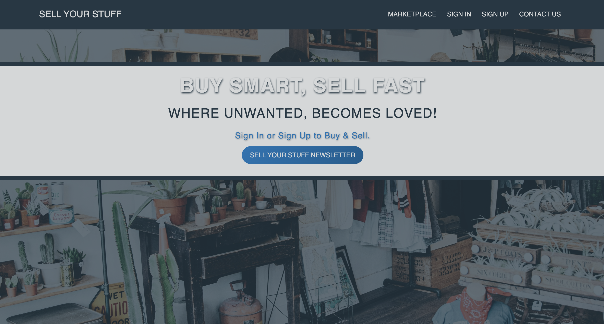
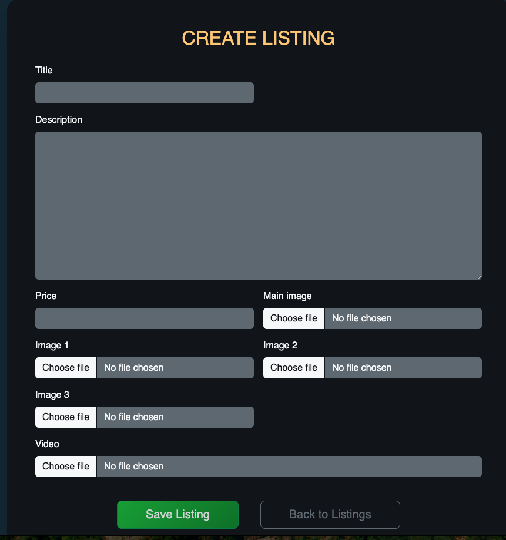
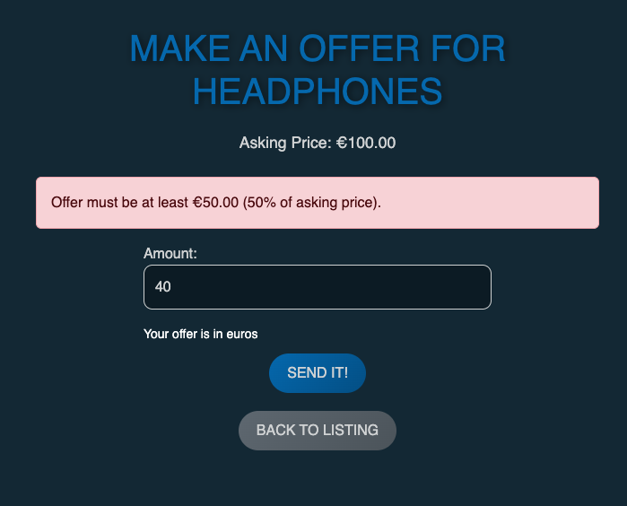
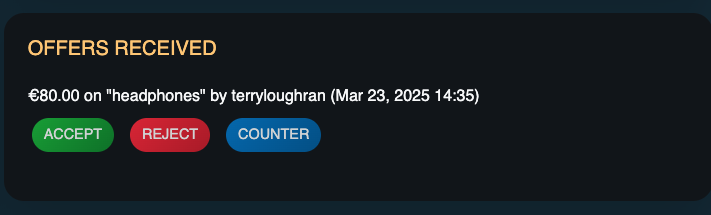
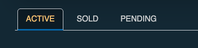
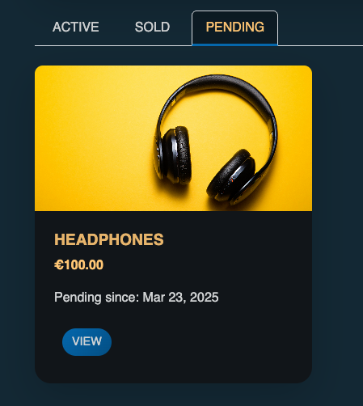
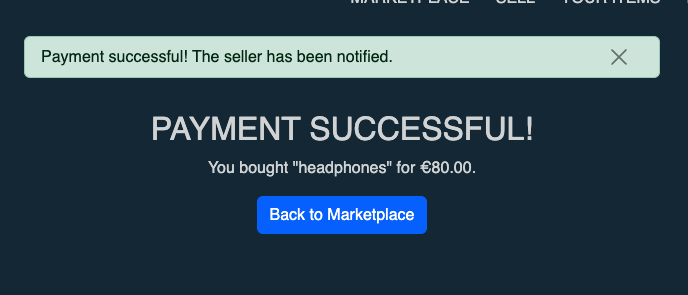

<h1>SELL UR STUFF - APP / SITE</h1>

<h2 id="project-purpose">Project Purpose</h2>

The purpose of this application is to revolutionize the online classifieds marketplace by building a user-friendly, dynamic platform that facilitates buying and selling items while leveraging multimedia. Unlike traditional classifieds sites, our application integrates video functionality, allowing sellers to upload short videos showcasing their products. This visual component provides buyers with a more comprehensive and engaging view of items, increasing trust and speeding up the sales process.

Sellers can also boost their product visibility by paying for a 24-hour feature on a dedicated "Sales Blitz" page. This premium service ensures prominent placement and increased exposure to potential buyers, helping sellers secure quicker sales.

<h2>Table of Contents</h2>
<ul>
    <li><a href="#project-purpose">Project Purpose</a></li>
    <li><a href="#target-audience">Target Audience</a></li>
    <li><a href="#the-problem-it-solves">The Problem It Solves</a></li>
    <li><a href="#user-stories">User Stories</a>
        <ul>
            <li><a href="#a-seller-stories">A. Seller Stories</a></li>
            <li><a href="#b-buyer-stories">B. Buyer Stories</a></li>
            <li><a href="#c-administrator-stories">C. Administrator Stories</a></li>
        </ul>
    </li>
    <li><a href="#project-requirements">Project Requirements</a>
        <ul>
            <li><a href="#a-e-commerce-requirements">A. E-commerce Requirements</a></li>
            <li><a href="#b-authentication-authorization-requirements">B. Authentication & Authorization Requirements</a></li>
        </ul>
    </li>
    <li><a href="#tech-stack">Tech Stack</a></li>
    <li><a href="#agile-workflow">Agile Workflow</a>
        <ul>
            <li><a href="#github-issues">GitHub Issues</a></li>
            <li><a href="#github-project-board">GitHub Project Board</a></li>
            <li><a href="#sprints">Sprints</a></li>
        </ul>
    </li>
    <li><a href="#setup-instructions">Setup Instructions</a>
        <ul>
            <li><a href="#prerequisites">Prerequisites</a></li>
            <li><a href="#local-development-setup">Local Development Setup</a></li>
            <li><a href="#media-storage-local">Media Storage (Local)</a></li>
        </ul>
    </li>
    <li><a href="#deployment-to-heroku">Deployment to Heroku</a>
        <ul>
            <li><a href="#prerequisites-1">Prerequisites</a></li>
            <li><a href="#deployment-steps">Deployment Steps</a></li>
            <li><a href="#media-storage-production">Media Storage (Production)</a></li>
        </ul>
    </li>
    <li><a href="#ux-design">UX Design</a></li>
    <li><a href="#testing">Testing</a></li>
    <li><a href="#project-structure">Project Structure</a></li>
    <li><a href="#issues-encountered">Issues Encountered</a></li>
    <li><a href="#contributing">Contributing</a></li>
    <li><a href="#known-issues">Known Issues</a></li>
    <li><a href="#future-enhancements">Future Enhancements</a></li>
    <li><a href="#contact">Contact</a></li>
</ul>

<h2 id="target-audience">Target Audience</h2>
<ul>
    <li><strong>Private Sellers</strong>: Individuals looking to offload personal belongings quickly, from household items to gadgets, without complex listing procedures.</li>
    <li><strong>Casual Sellers</strong>: Users with small inventories who want an intuitive, visually appealing platform to test online selling.</li>
    <li><strong>Tech-Savvy Users</strong>: Individuals comfortable with multimedia-rich platforms, seeking a modern alternative to traditional classifieds.</li>
    <li><strong>Value Seekers</strong>: Buyers who value transparency through video listings for informed purchase decisions.</li>
</ul>

<h2 id="the-problem-it-solves">The Problem It Solves</h2>

Traditional classified platforms often have outdated interfaces, lack multimedia integration, and offer limited visibility options for sellers, leading to slower sales and a less engaging experience. Our application addresses these issues by:

<ul>
    <li><strong>Enhancing User Experience</strong>: Providing a modern, streamlined interface that's accessible and intuitive.</li>
    <li><strong>Multimedia Integration</strong>: Allowing video uploads for richer, more engaging content that builds buyer confidence.</li>
    <li><strong>Paid Boost Options</strong>: Offering a 24-hour "Sales Blitz" page for increased exposure and faster sales.</li>
    <li><strong>Targeted Functionality</strong>: Catering to private and casual sellers while appealing to tech-savvy consumers.</li>
</ul>

<h2 id="user-stories">User Stories</h2>

<h3 id="a-seller-stories">A. Seller Stories</h3>
<ul>
    <li><strong>Seller-01</strong>: As a seller, I want to register an account to list and manage my products securely.</li>
    <li><strong>Seller-02</strong>: As a seller, I want to create a product listing with descriptions and a video to give buyers a clear, engaging view.
        <ul>
            <li><em>Example</em>: The "Create Listing" form allows sellers to add a title, description, price, and upload images/videos.</li>
        </ul>
        
The "Create Listing" form where sellers can input details and upload media for their products.

    </li>
    <li><strong>Seller-03</strong>: As a seller, I want to edit or delete listings to manage outdated or sold items.
        <ul>
            <li><em>Example</em>: The "Your Offers" section shows the status of offers and provides a "Pay Now" option for accepted offers.</li>
        </ul>
        
BUYER

        
        

         - Feedback message indicating an offer is below the minimum threshold.

        
SELLER

        
        
The "Your Offers" section displaying an accepted offer with a "Pay Now" button.

    </li>
</ul>

<h3 id="b-buyer-stories">B. Buyer Stories</h3>
<ul>
    <li><strong>Buyer-01</strong>: As a buyer, I want to browse and search for product listings to find items that interest me.
        <ul>
            <li><em>Example</em>: Listings are categorized into "Active," "Sold," and "Pending" tabs for easy browsing.</li>
        </ul>
        
        Tabs for browsing listings: "Active," "Sold," and "Pending."

    </li>
    <li><strong>Buyer-02</strong>: As a buyer, I want to view detailed product pages with text and video for informed decisions.
        <ul>
            <li><em>Example</em>: A product listing for "headphones" shows the price, status, and a preview image.</li>
        </ul>
        A product listing for "headphones" with price and status details.

    </li>
    <li><strong>Buyer-03</strong>: As a buyer, I want to contact sellers securely via a messaging system without leaving the platform.</li>
    <li><strong>Buyer-04</strong>: As a buyer, I want clear feedback when interacting with the site to know what to expect.
        <ul>
            <li><em>Example</em>: After making an offer, buyers receive feedback if the offer is too low or accepted.</li>
        </ul>
        
    </li>
</ul>

<h3 id="c-administrator-stories">C. Administrator Stories</h3>
<ul>
    <li><strong>Admin-01</strong>: As an administrator, I want to manage user accounts and roles to ensure authorized access.</li>
    <li><strong>Admin-02</strong>: As an administrator, I want to review and moderate listings and content to maintain quality.</li>
    <li><strong>Admin-03</strong>: As an administrator, I want to view reports on sales, user activity, and boost transactions to assess performance.</li>
    <li><strong>Admin-04</strong>: As an administrator, I want to manage payment transactions for smooth e-commerce functionality.</li>
    <li><strong>Admin-05</strong>: As an administrator, I want to configure SEO settings and monitor site indexing for optimal visibility.</li>
</ul>

<h2 id="project-requirements">Project Requirements</h2>

<h3 id="a-e-commerce-requirements">A. E-commerce Requirements</h3>
<ul>
    <li>Integrate an online payment system (e.g., Stripe) for boosted listings.
        <ul>
            <li><em>Example</em>: A confirmation message appears after a successful payment.</li>
        </ul> 
       
Payment confirmation message after purchasing "headphones."

    </li>
    <li>Enable video uploads with validations (file type, size, etc.).</li>
    <li>Create an administrative dashboard for reviewing transactions and sales performance.</li>
</ul>

<h3 id="b-authentication-authorization-requirements">B. Authentication & Authorization Requirements</h3>
<ul>
    <li>Implement secure registration and login pages using Django's authentication framework.</li>
    <li>Define roles and restrict access based on user permissions.</li>
    <li>Ensure security best practices for sensitive data handling.</li>
</ul>

<h2 id="tech-stack">Tech Stack</h2>
<ul>
    <li><strong>Framework</strong>: Django 5.1.6</li>
    <li><strong>Language</strong>: Python 3.13.1</li>
    <li><strong>Database</strong>:
        <ul>
            <li>Local: SQLite</li>
            <li>Production: PostgreSQL (via Heroku)</li>
        </ul>
    </li>
    <li><strong>Media Storage</strong>:
        <ul>
            <li>Local: Filesystem (<code>MEDIA_ROOT</code>)</li>
            <li>Production: Amazon S3 (using <code>django-storages</code> and <code>boto3</code>)</li>
        </ul>
    </li>
    <li><strong>Static Files</strong>: Whitenoise (for serving static files on Heroku)</li>
    <li><strong>Authentication</strong>: Django Allauth</li>
    <li><strong>Payment Processing</strong>: Stripe</li>
    <li><strong>Deployment</strong>: Heroku</li>
    <li><strong>Environment Management</strong>: <code>python-dotenv</code> for managing environment variables</li>
</ul>

<h2 id="agile-workflow">Agile Workflow</h2>

This project uses GitHub Issues and Projects to manage development in an Agile manner, with sprints and a Kanban board to track progress.

<a href="https://dbdocs.io/terryloughran/Sell-Your-Stuff">Sell Your Stuff ERD</a> for further project flow.

<h3 id="github-issues">GitHub Issues</h3>
<ul>
    <li>Each user story and task is documented as a GitHub Issue.</li>
    <li>Issues are labeled (e.g., <code>user-story</code>, <code>seller</code>, <code>buyer</code>, <code>admin</code>, <code>task</code>) and assigned to milestones (sprints).</li>
    <li>Example: [User Story] Seller-01: Register an Account (#2)</li>
</ul>

<h3 id="github-project-board">GitHub Project Board</h3>
<ul>
    <li>The project board is divided into columns: <strong>Backlog</strong>, <strong>To Do</strong>, <strong>In Progress</strong>, <strong>In Review</strong>, and <strong>Done</strong>.</li>
    <li>Issues are moved through these columns as work progresses.</li>
    <li>Link to the project board: <a href="https://github.com/users/TerryLoc/projects/4">Sell Ur Stuff Project Board</a>.</li>
</ul>

<h3 id="sprints">Sprints</h3>
<ul>
    <li><strong>Sprint 1 (Setup and Authentication)</strong>:
        <ul>
            <li>Issues: <code>Project Setup and Environment Configuration (#1)</code>, <code>Authentication & Authorization (#2)</code></li>
            <li>Focus: Set up the project environment and implement user registration/login.</li>
        </ul>
    </li>
    <li><strong>Sprint 2 (Product Listings and E-commerce)</strong>:
        <ul>
            <li>Issues: <code>Product Listing and CRUD Operations (#3)</code>, <code>E-commerce and Payment Integration (#4)</code></li>
            <li>Focus: Implement product listings with video uploads and Stripe payment for boosts.</li>
        </ul>
    </li>
    <li><strong>Sprint 3 (UX and SEO)</strong>:
        <ul>
            <li>Issues: <code>Front-End Design and User Experience (UX) (#5)</code>, <code>SEO and Marketing Integration (#6)</code></li>
            <li>Focus: Enhance the UI/UX and implement SEO features.</li>
        </ul>
    </li>
</ul>

<h2 id="setup-instructions">Setup Instructions</h2>

<h3 id="prerequisites">Prerequisites</h3>
<ul>
    <li>Python 3.13.1 or higher</li>
    <li>Git</li>
    <li>Heroku CLI (for deployment)</li>
    <li>An AWS account (for S3 storage in production)</li>
    <li>A Stripe account (for payment processing)</li>
</ul>

<h3 id="local-development-setup">Local Development Setup</h3>
<ol>
    <li><strong>Clone the Repository</strong>:
        <pre><code>git clone https://github.com/your-username/sell-ur-stuff.git
cd sell-ur-stuff</code></pre>
    </li>
    <li><strong>Create a Virtual Environment</strong>:
        <pre><code>python -m venv .venv
source .venv/bin/activate  # On Windows: .venv\Scripts\activate</code></pre>
    </li>
    <li><strong>Install Dependencies</strong>:
        <pre><code>pip install -r requirements.txt</code></pre>
    </li>
    <li><strong>Set Up Environment Variables</strong>:
        <ul>
            <li>Create a <code>.env</code> file in the project root (<code>sell_ur_stuff/.env</code>):
                <pre><code>DEBUG=True
SECRET_KEY=your-secret-key
STRIPE_PUBLIC_KEY=your-stripe-public-key
STRIPE_SECRET_KEY=your-stripe-secret-key</code></pre>
            </li>
            <li>Generate a <code>SECRET_KEY</code> (e.g., using Django's <code>get_random_secret_key()</code> in a Python shell).</li>
        </ul>
    </li>
    <li><strong>Run Migrations</strong>:
        <pre><code>python manage.py migrate</code></pre>
    </li>
    <li><strong>Create a Superuser (Admin)</strong>:
        <pre><code>python manage.py createsuperuser</code></pre>
    </li>
    <li><strong>Collect Static Files</strong>:
        <pre><code>python manage.py collectstatic</code></pre>
    </li>
    <li><strong>Run the Development Server</strong>:
        <pre><code>python manage.py runserver</code></pre>
        <ul>
            <li>Access the site at <code>http://localhost:8000/</code>.</li>
            <li>Access the admin panel at <code>http://localhost:8000/admin/</code>.</li>
        </ul>
    </li>
</ol>

<h3 id="media-storage-local">Media Storage (Local)</h3>
<ul>
    <li>Media files (e.g., profile pictures, videos) are stored locally in <code>sell_ur_stuff/media/</code>.</li>
    <li>Ensure the <code>media</code> directory exists:
        <pre><code>mkdir -p media/profile_pics</code></pre>
    </li>
</ul>

<h2 id="deployment-to-heroku">Deployment to Heroku</h2>

<h3 id="prerequisites-1">Prerequisites</h3>
<ul>
    <li>A Heroku account and the Heroku CLI installed.</li>
    <li>An Amazon S3 bucket for media storage.</li>
    <li>A PostgreSQL database (Heroku Postgres add-on).</li>
</ul>

<h3 id="deployment-steps">Deployment Steps</h3>
<ol>
    <li><strong>Log in to Heroku</strong>:
        <pre><code>heroku login</code></pre>
    </li>
    <li><strong>Create a Heroku App</strong> (if not already created):
        <pre><code>heroku create sell-ur-stuff-19632c616966</code></pre>
    </li>
    <li><strong>Add Heroku Postgres</strong>:
        <pre><code>heroku addons:create heroku-postgresql:hobby-dev</code></pre>
    </li>
    <li><strong>Set Environment Variables</strong>:
        <pre><code>heroku config:set DEBUG=False
heroku config:set SECRET_KEY=your-secret-key
heroku config:set STRIPE_PUBLIC_KEY=your-stripe-public-key
heroku config:set STRIPE_SECRET_KEY=your-stripe-secret-key
heroku config:set AWS_STORAGE_BUCKET_NAME=your-s3-bucket-name
heroku config:set AWS_S3_REGION_NAME=your-s3-region
heroku config:set AWS_ACCESS_KEY_ID=your-aws-access-key
heroku config:set AWS_SECRET_ACCESS_KEY=your-aws-secret-key</code></pre>
    </li>
    <li><strong>Deploy the App</strong>:
        <pre><code>git add .
git commit -m "Prepare for Heroku deployment"
git push heroku main</code></pre>
    </li>
    <li><strong>Run Migrations on Heroku</strong>:
        <pre><code>heroku run python manage.py migrate</code></pre>
    </li>
    <li><strong>Create a Superuser on Heroku</strong>:
        <pre><code>heroku run python manage.py createsuperuser</code></pre>
    </li>
    <li><strong>Collect Static Files</strong>:
        <ul>
            <li>Whitenoise will handle static files automatically on Heroku.</li>
        </ul>
    </li>
    <li><strong>Access the Live Site</strong>:
        <ul>
            <li>Open the app:
                <pre><code>heroku open</code></pre>
            </li>
            <li>The site should be live at <code>https://sell-ur-stuff-19632c616966.herokuapp.com/</code>.</li>
        </ul>
    </li>
</ol>

<h3 id="media-storage-production">Media Storage (Production)</h3>
<ul>
    <li>Media files are stored in an Amazon S3 bucket.</li>
    <li>Ensure your S3 bucket has a public read policy for objects:
        <pre><code>{
"Version": "2012-10-17",
"Statement": [
    {
        "Effect": "Allow",
        "Principal": "*",
        "Action": "s3:GetObject",
        "Resource": "arn:aws:s3:::bucket-name/*"
    },
    {
        "Effect": "Allow",
        "Principal": {
            "AWS": "arn:aws:iam:::account-id/the-user"
        },
        "Action": [
            "s3:PutObject",
            "s3:PutObjectAcl"
        ],
        "Resource": "arn:aws:s3:::bucket-name/*"
    }
]
}</code></pre>
    </li>
    <li>Adjust the S3 bucket's Block Public Access settings to allow public read access via policies:
        <ul>
            <li>Uncheck "Block all public access".</li>
            <li>Keep ACL blocking enabled for security.</li>
            <li>Uncheck policy blocking to allow public read access via the bucket policy.</li>
        </ul>
    </li>
</ul>

<h2 id="ux-design">UX Design</h2>

<h3>Design Process</h3>

The UX design for <strong>Sell Ur Stuff</strong> focused on creating an intuitive and engaging experience for private sellers, casual sellers, tech-savvy users, and value seekers. The process included:

<h3>Wireframes</h3>
<ul>
    <li>Created wireframes for key pages (e.g., homepage, product listing page, profile page) using tools like Figma.</li>
    <li><strong>Homepage</strong>: Featured a search bar, featured listings (Sales Blitz), and navigation links to Market, Profiles, and Contact.</li>
    <li><strong>Product Listing Page</strong>: Included a video player, product description, and a "Contact Seller" button.</li>
    <li><strong>Profile Page</strong>: Displayed the user's profile picture, a list of their listings, and an "Edit Profile" button.</li>
</ul>

<h3>Mockups</h3>
<ul>
    <li>Developed high-fidelity mockups to finalize the design.</li>
    <li>Used a clean, modern design with a focus on multimedia (e.g., large video player for product listings).</li>
    <li>Ensured responsiveness with a mobile-first approach (e.g., collapsible navigation menu on mobile).</li>
</ul>

<h3>User Feedback</h3>
<ul>
    <li>Conducted informal user testing with peers to gather feedback on usability.</li>
    <li>Adjusted the design to improve navigation (e.g., added a "Back to Listings" button on product pages).</li>
</ul>

<h3>Implementation</h3>

The wireframes and mockups were implemented using Django templates and Bootstrap for styling.

<ul>
    <li><strong>Homepage</strong>: <code>templates/home/home.html</code> includes a search bar and featured listings.</li>
    <li><strong>Product Listing Page</strong>: <code>templates/market/listing_detail.html</code> includes a video player.</li>
    <li><strong>Profile Page</strong>: <code>templates/profiles/profile.html</code> displays the user's profile picture (<code>&lt;img src=""&gt;</code>) and listings.</li>
    <li>The design ensures responsiveness across devices, tested using Chrome DevTools.</li>
</ul>

<h3>Diagrams</h3>
<ul>
    <li>Wireframes and mockups are stored in the <code>docs/ux/</code> directory (create this directory if it doesn't exist).</li>
    <li>Example: <code>docs/ux/homepage-wireframe.png</code>, <code>docs/ux/product-listing-mockup.png</code>.</li>
</ul>

<h2 id="testing">Testing</h2>

Testing procedures are documented in <a href="TESTING.md">TESTING.md</a>. Key areas include:

<ul>
    <li><strong>Functionality</strong>: Tested all user stories (e.g., registration, product listing creation, payment for boosts).</li>
    <li><strong>Usability</strong>: Ensured intuitive navigation and clear feedback (e.g., form validation errors).</li>
    <li><strong>Responsiveness</strong>: Tested on multiple devices using Chrome DevTools.</li>
    <li><strong>Data Management</strong>: Verified media storage (local filesystem and S3) and database operations.</li>
    <li>Automated tests are implemented in each app (e.g., <code>profiles/tests.py</code> for profile picture uploads).</li>
</ul>

<h2 id="project-structure">Project Structure</h2>
<pre><code>sell_ur_stuff/
├── home/                # App for homepage functionality
├── sales/               # App for Sales Blitz and boost features
├── market/              # App for product listings and browsing
├── profiles/            # App for user profiles and media uploads
├── contact/             # App for contact/inquiry system
├── static/              # Static files (CSS, JS, images)
├── media/               # Media files (local development only)
├── templates/           # Base templates and shared HTML
├── sell_ur_stuff_site/  # Project settings and URLs
├── manage.py            # Django management script
├── requirements.txt     # Python dependencies
└── .env                 # Environment variables (not tracked in git)</code></pre>

<h2 id="issues-encountered">Issues Encountered</h2>

During development, we faced several challenges, which are documented here for reference:

<ul>
    <li><strong>Media Serving in Development</strong>:
        <ul>
            <li><strong>Issue</strong>: Profile pictures (e.g., <code>glass-3077869_640.jpg</code>) were not displaying locally, returning a 404 error at <code>http://localhost:8000/media/profile_pics/glass-3077869_640.jpg</code>, despite the file existing in <code>sell_ur_stuff/media/profile_pics/</code>.</li>
            <li><strong>Cause</strong>: The <code>DEBUG</code> setting was evaluating to <code>False</code> due to an incorrect comparison (<code>os.getenv("DEBUG", False) == True</code>), preventing Django from serving media files via <code>static(settings.MEDIA_URL, document_root=settings.MEDIA_ROOT)</code> in <code>urls.py</code>.</li>
            <li><strong>Resolution</strong>: Updated the <code>DEBUG</code> setting to compare strings (<code>os.getenv("DEBUG", "False") == "True"</code>), ensuring <code>DEBUG</code> was <code>True</code> in development. Added debugging print statements to confirm the <code>.env</code> file was loaded correctly.</li>
        </ul>
    </li>
    <li><strong>S3 Configuration in Production</strong>:
        <ul>
            <li><strong>Issue</strong>: Images were not accessible on Heroku after switching from Cloudinary to Amazon S3, due to S3's Block Public Access settings.</li>
            <li><strong>Cause</strong>: The S3 bucket had "Block all public access" enabled, preventing public read access to objects, even with a bucket policy allowing <code>s3:GetObject</code>.</li>
            <li><strong>Resolution</strong>: Adjusted the Block Public Access settings to allow public read access via bucket policies (unchecked "Block public access to buckets and objects granted through new public bucket or access point policies" and "Block public and cross-account access..."). Added a bucket policy to allow public read access to objects.</li>
        </ul>
    </li>
    <li><strong>Cloudinary Leftovers</strong>:
        <ul>
            <li><strong>Issue</strong>: <code>cloudinary</code> and <code>cloudinary_storage</code> were still in <code>INSTALLED_APPS</code>, causing potential conflicts after switching to S3.</li>
            <li><strong>Resolution</strong>: Removed <code>cloudinary</code> and <code>cloudinary_storage</code> from <code>INSTALLED_APPS</code> and uninstalled them from <code>requirements.txt</code>.</li>
        </ul>
    </li>
    <li><strong>Database Configuration Missing</strong>:
        <ul>
            <li><strong>Issue</strong>: The <code>DATABASES</code> setting was missing in <code>settings.py</code>, which could cause issues on Heroku.</li>
            <li><strong>Resolution</strong>: Added <code>dj_database_url</code> to parse <code>DATABASE_URL</code> on Heroku and configured <code>DATABASES</code> to use SQLite locally and PostgreSQL in production.</li>
        </ul>
    </li>
</ul>

<h2 id="contributing">Contributing</h2>
<ol>
    <li>Fork the repository.</li>
    <li>Create a new branch:
        <pre><code>git checkout -b feature/your-feature-name</code></pre>
    </li>
    <li>Make your changes and commit:
        <pre><code>git commit -m "Add your feature"</code></pre>
    </li>
    <li>Push to your fork:
        <pre><code>git push origin feature/your-feature-name</code></pre>
    </li>
    <li>Create a pull request on GitHub.</li>
</ol>

<h2 id="known-issues">Known Issues</h2>
<ul>
    <li><strong>Email Verification</strong>: Currently set to <code>none</code> (<code>ACCOUNT_EMAIL_VERIFICATION = "none"</code>). Set to <code>mandatory</code> in production and configure an email backend (e.g., SendGrid).</li>
    <li><strong>Video Uploads</strong>: Ensure video file validations (size, format) are implemented in the <code>market</code> app.</li>
    <li><strong>Images</strong>: I cannot seem to get the images to show on the live site. I tried <code>cloudinary</code> and am now using <code>AWS</code>, but I cannot get either to allow me to upload. I have hit a wall!</li>
</ul>

<h2 id="future-enhancements">Future Enhancements</h2>
<ul>
    <li>Add a messaging system for secure buyer-seller communication.</li>
    <li>Implement video compression for faster uploads and streaming.</li>
    <li>Add analytics for sellers to track listing views and engagement.</li>
    <li>Integrate a review/rating system for buyers and sellers.</li>
    <li>Enhance the newsletter subscription feature with better user feedback.</li>
</ul>

<h2 id="contact">Contact</h2>

For questions or support, contact the project maintainer <a href="https://github.com/TerryLoc">TERRY</a>.

